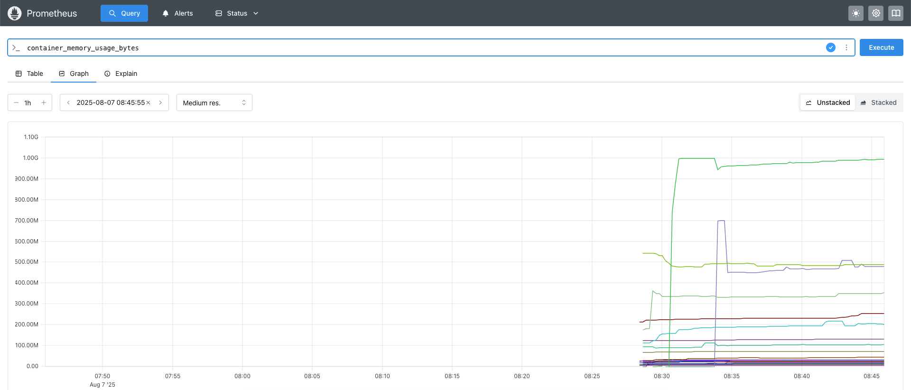
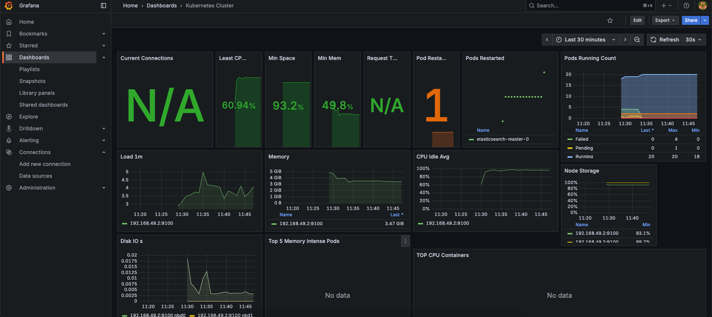
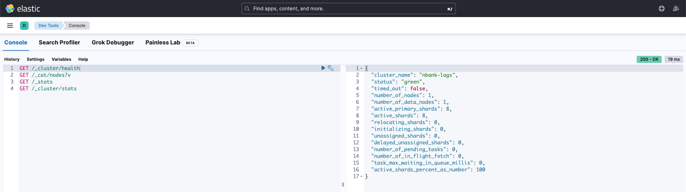
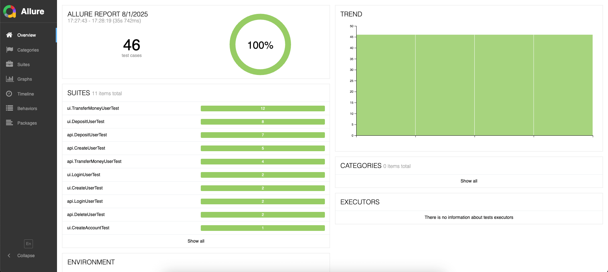
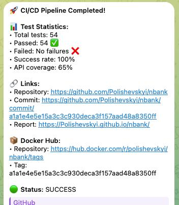

<div align="center">


</div>

## NBank Project

A comprehensive set of API and UI automated tests for a banking application. Tests can be run locally, in Docker, and with infrastructure (Docker Compose/Kubernetes). Includes integrations with Allure and Swagger Coverage, scripts for full pipeline and Telegram notifications.

### Requirements and Installation

- Java 21, Maven 3.9+
- Docker, Docker Compose
- Optional: Allure CLI (`brew install allure`), `jq`, `wget`, `unzip` (for Swagger Coverage CLI)

---

### Configuration

Main configuration file: `src/main/resources/config.properties`.

```properties
apiBaseUrl=http://localhost:4111
apiVersion=/api/v1
admin.username=admin
admin.password=admin
uiRemote=http://localhost:4444/wd/hub
uiBaseUrl=http://localhost:3000
browser=chrome
browserSize=1920x1080
```

- JUnit parallelism is controlled by `src/test/resources/junit-platform.properties`.
- Checkstyle is used with Google profile (`google_checks.xml`).

---

### Running Tests

#### Locally (Maven)

- API tests: `./mvnw clean test -Papi`
- UI tests: `./mvnw clean test -Pui`

#### Locally with API Coverage and Allure Integration

```bash
./run-tests-local.sh api   # or ui
```

#### In Docker (a container with Maven/Java inside)

```bash
./run-tests.sh api   # or ui
```

Logs, results, and HTML reports will be mounted to `./test-output/<timestamp>/`.

#### With Docker Compose (backend, frontend, Selenoid)

```bash
./run-tests-with-docker-compose.sh
```

The script starts the infrastructure from `infra/docker_compose/docker-compose.yml`, runs tests in the `nbank-network`, and properly stops everything.

#### Full Local Pipeline with Quality Gate

```bash
./run-full-pipeline.sh
```

Requires Swagger Coverage CLI. If not available, the script will show how to download it.

---

### Reports

- Allure: results in `target/allure-results`. Generate HTML:
  ```bash
  allure generate target/allure-results --clean -o allure-report
  allure open allure-report
  ```
- Swagger Coverage: integration into Allure is performed by script `./integrate-api-coverage.sh` (creates environment.properties and synthetic test "API Coverage Dashboard").

---

### Scripts

- `run-tests-local.sh` — local test execution with API Coverage integration and Allure generation.
- `run-tests.sh` — Docker image build and test execution in a container; exports logs/reports.
- `run-tests-with-docker-compose.sh` — start backend/frontend/selenoid and run tests in one network.
- `run-full-pipeline.sh` — full pipeline: clean, build, API tests, Swagger Coverage, Quality Gate, Allure integration, report generation.
- `integrate-api-coverage.sh` — run Swagger Coverage CLI, aggregate metrics in Allure, add HTML/JSON to attachments.
- `check-api-coverage.sh` — Quality Gate (fails build if coverage < 50%).
- `push-tests.sh` — tag and push Docker image with tests. Requires `.env` with `DOCKERHUB_TOKEN`.
- `send-telegram-notification.sh` — send summary to Telegram (expects environment variables).

---

### Environment Variables and Secrets

#### GitHub Secrets Setup

**Docker Hub Secrets:**

- `DOCKER_USERNAME` - Docker Hub username
- `DOCKER_PASSWORD` - Docker Hub password/token (recommended: use access token instead of password)

**Telegram Secrets:**

- `TELEGRAM_BOT_TOKEN` - Telegram bot token (get from @BotFather)
- `TELEGRAM_CHAT_ID` - Telegram chat ID for notifications (can be user ID or group ID)

---

### Docker Compose Setup

#### Start Infrastructure

```bash
cd infra/docker_compose
docker compose up -d
```

This starts:

- **Backend** (port 4111) - Banking API
- **Frontend** (port 3000) - Web UI with NGINX
- **Selenoid** (port 4444) - Browser grid for UI tests
- **Selenoid UI** (port 8080) - Web interface for Selenoid

#### Stop Infrastructure

```bash
docker compose down
```

#### View Logs

```bash
docker compose logs -f [service_name]
```

---

### Programming Patterns

#### API

- Request/Response Specifications:
  - `api.specs.RequestSpecs` — single constructor for `RequestSpecification`: JSON, logging, Allure, SwaggerCoverage, `baseUri` from config. Caching of user authorization header (`getUserAuthHeader`).
  - `api.specs.ResponseSpecs` — set of ready `ResponseSpecification` (OK/CREATED/BAD_REQUEST/NOT_FOUND) with matchers.
- Resource Description:
  - `api.requests.skelethon.Endpoint` — `enum` with resource path and request/response DTO types (centralized API map).
- Request Level:
  - `CrudRequester` — low-level CRUD, returns `ValidatableResponse` for flexible checks and status codes.
  - `ValidatedCrudRequester<T>` — generic wrapper that deserializes the body into typed models (`T`) and simplifies positive scenarios.
- Step Level (use-cases):
  - `api.requests.steps.AdminSteps`, `UserSteps` — business steps with logging through `StepLogger`, encapsulate creation/deletion/queries, reused in tests.
- Data Generation:
  - `RandomModelGenerator` + `@GeneratingRule(regex=...)` — reflective DTO population (strings/numbers/lists/date) or by regex.
  - `RandomData` — utilities for usernames/passwords/IDs.
- DTO Comparison (request vs response):
  - `ModelAssertions.assertThatModels(req, res).match()` — reads rules from `model-comparison.properties` and verifies fields through `ModelComparator`.

Why this way: layering (Specs → Requesters → Steps) isolates Rest-Assured infrastructure, makes steps stable and reusable; `Endpoint` ensures a single source of truth for URL/DTO; data generation and configuration-based comparison simplify maintenance.

#### UI

- Page Object:
  - Base `ui.pages.BasePage` — page URL, opening via `Selenide.open`, common fields (`usernameInput`, `passwordInput`), helper `checkAlertMessageAndAccept`, `generatePageElements` for mapping `ElementsCollection → List<BaseElement>`.
  - Pages: `LoginPage`, `UserDashboard`, `ProfilePage`, `DepositPage`, `TransferPage` — only user actions and minimal logic.
- Elements:
  - `ui.elements.BaseElement` + `UserBage` — encapsulation of complex widgets and parsing their state.
- Sessions and Authentication:
  - `BasePage.authAsUser(...)` — UI login via `authToken` record in `localStorage` (token taken from API via `RequestSpecs`).
  - JUnit extensions: `@AdminSession`, `@UserSession` + `AdminSessionExtension`, `UserSessionExtension` — user creation before test, cleanup after, automatic UI authorization.
- Reliability and Execution Control:
  - `@Browsers` + `BrowserMatchExtension` — test execution condition depending on browser.
  - `@RetryOnFailure` + `RetryOnFailureExtension` — short retries for flaky tests.
  - `TimingExtension` — test timing collection.

Why this way: Page Object minimizes duplication; element wrappers simplify work with complex blocks; JUnit extensions make tests isolated (fresh users), fast (authorization without UI) and stable.

---

### GitHub Actions Workflow

The project includes a CI/CD pipeline with the following flow:

#### Pipeline Steps

1. **Checkout** - Clone repository with full history
2. **Setup Java** - Install Java 21 and Maven 3.9+
3. **Cache Dependencies** - Cache Maven dependencies for faster builds
4. **Run API Tests** - Execute API tests with profile `api` using JUnit 5
5. **Generate Swagger Coverage** - Analyze API coverage using swagger-coverage-rest-assured
6. **Quality Gate Check** - Verify coverage meets threshold (50%) using `check-api-coverage.sh`
7. **Generate Allure Report** - Create interactive test reports with screenshots and logs
8. **Upload Artifacts** - Store test results, reports, and coverage data
9. **Build Docker Image** - Create a test container image with Maven and Java
10. **Push to Docker Hub** - Upload image to registry with proper tagging
11. **Send Telegram Notification** - Report results to Telegram with links and statistics

#### Workflow Triggers

- **Push to `main` branch** - Automatic trigger on code changes
- **Pull request to `main` branch** - Trigger on PR creation/updates
- **Manual workflow dispatch** - Manual trigger from GitHub Actions tab

#### Artifacts Generated

- **Test Results** - JUnit XML reports with detailed test execution data
- **Allure HTML Report** - Interactive dashboard with test steps, screenshots, and environment info
- **Swagger Coverage Report** - API coverage analysis with endpoint statistics
- **Docker Image** - Containerized test environment ready for deployment

#### Quality Gates

- **API Coverage Threshold** - Minimum 50% coverage required
- **Test Success Rate** - All tests must pass
- **Build Success** - Docker image must build successfully

---

### Kubernetes Helm Chart (overview)

- Path: `infra/kube/nbank-chart`. In `values.yaml` configured images and NodePort services for backend/frontend/selenoid/selenoid-ui.
- Additional manifests for monitoring and logging in `infra/kube/monitoring` and `infra/kube/logging`.

---

### Screenshots and Examples

#### Monitoring and Observability

**Prometheus Dashboard**



Container memory usage monitoring in Prometheus showing resource utilization over time

**Grafana Kubernetes Dashboard**



Comprehensive Kubernetes cluster monitoring with resource metrics, pod status, and performance indicators

**Elasticsearch Dev Tools**



Elasticsearch cluster health monitoring showing green status and cluster statistics

#### Test Results and Reports

**Allure Test Report**



Interactive test report showing 46 test cases with 100% pass rate, detailed test suites breakdown

**CI/CD Pipeline Notification**



Automated Telegram notification with test statistics, coverage metrics, and deployment links

---

### Useful Links

- **Online Reports**: [https://polishevskyi.github.io/nbank/](https://polishevskyi.github.io/nbank/) - Live test reports and coverage analysis
- Docker Compose config: `infra/docker_compose/docker-compose.yml` (ports: backend 4111, frontend 3000, selenoid 4444, selenoid-ui 8080)
- Kubernetes configs: `infra/kube/nbank-chart/values.yaml`
- Maven profiles: `pom.xml` → `api`, `ui`
