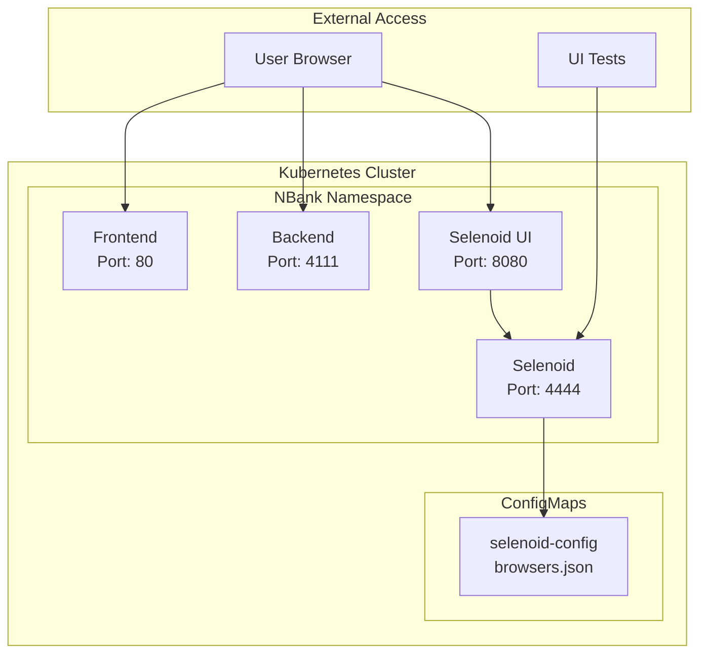

# 🚀 NBank Kubernetes Deployment

This directory contains all necessary files for deploying NBank application in Kubernetes using Helm.

## 📁 File Structure

```
kube/
├── nbank-chart/                 # Helm Chart
│   ├── Chart.yaml              # Chart metadata
│   ├── values.yaml             # Services configuration
│   ├── files/
│   │   └── browsers.json       # Browser configuration for Selenoid
│   └── templates/
│       ├── backend.yaml        # Backend Deployment + Service
│       ├── frontend.yaml       # Frontend Deployment + Service
│       ├── selenoid.yaml       # Selenoid Deployment + Service
│       ├── selenoid-ui.yaml    # Selenoid UI Deployment + Service
│       └── configmap.yaml      # ConfigMap for Selenoid
├── restart_kube.sh             # Main deployment script
├── port_forward.sh             # Port forwarding script
├── scaling_demo.sh             # Scaling demonstration
├── DEPLOYMENT_GUIDE.md         # Detailed instructions
├── KUBECTL_RESULTS.md          # kubectl execution results
└── README.md                   # This file
```

## 🎯 Quick Start

### 1. Deploy entire application:

```bash
cd infra/kube
./restart_kube.sh
```

### 2. Port forwarding for access:

```bash
./port_forward.sh
```

### 3. Scaling demonstration:

```bash
./scaling_demo.sh
```

## 🌐 Services Access

After running `port_forward.sh` services will be accessible:

| Service         | URL                   | Description             |
| --------------- | --------------------- | ----------------------- |
| **Frontend**    | http://localhost:3000 | Bank web interface      |
| **Backend**     | http://localhost:4111 | REST API + Health check |
| **Selenoid**    | http://localhost:4444 | WebDriver Hub           |
| **Selenoid UI** | http://localhost:8080 | Selenoid web interface  |

## 🔧 Basic Commands

### Cluster Management:

```bash
# Cluster status
kubectl cluster-info

# All resources
kubectl get all

# Services
kubectl get svc

# Pods
kubectl get pods -o wide
```

### Logs and Diagnostics:

```bash
# Service logs
kubectl logs deployment/backend

# Pod description
kubectl describe pod <pod-name>

# Cluster events
kubectl get events --sort-by=.metadata.creationTimestamp
```

### Scaling:

```bash
# Increase replica count
kubectl scale deployment backend --replicas=2

# Auto-scaling
kubectl autoscale deployment backend --cpu-percent=50 --min=1 --max=5

# Check HPA
kubectl get hpa
```

### Helm Operations:

```bash
# Release status
helm status nbank

# Upgrade
helm upgrade nbank ./nbank-chart

# Uninstall
helm uninstall nbank
```

## 📊 Services Architecture


