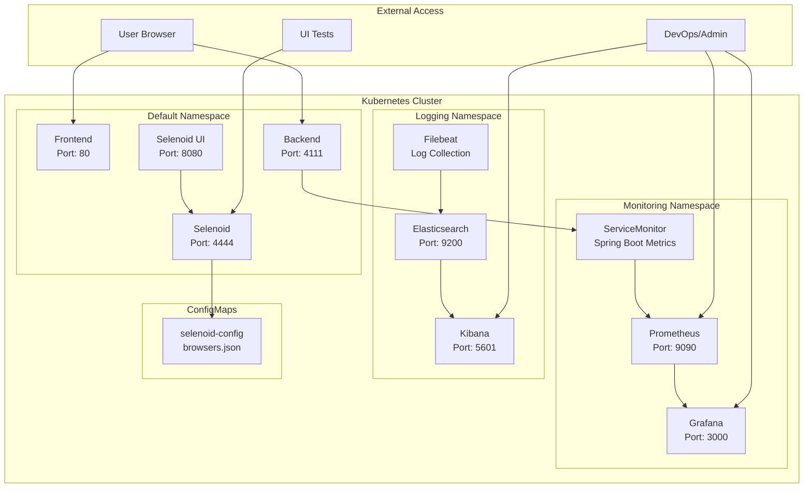

# 🚀 NBank Kubernetes Deployment with Monitoring Stack

This directory contains all necessary files for deploying NBank application in Kubernetes with complete monitoring and logging infrastructure using Helm.

## 📁 File Structure

```
kube/
├── 📁 monitoring/               # Prometheus + Grafana configs
│   ├── monitoring-values.yaml  # Prometheus + Grafana Helm values
│   └── spring-monitoring.yaml  # ServiceMonitor for Spring Boot
├── 📁 logging/                  # Elasticsearch + Kibana configs
│   ├── elasticsearch-simple.yaml    # Simple Elasticsearch deployment
│   ├── elasticsearch-values.yaml    # Elasticsearch Helm values
│   ├── kibana-simple.yaml          # Simple Kibana deployment
│   └── kibana-values.yaml          # Kibana Helm values
├── 📁 scripts/                  # Deployment and management scripts
│   ├── restart_kube.sh          # Complete deployment with monitoring
│   ├── port_forward.sh          # Port forwarding for all services
│   └── scaling_demo.sh          # Scaling demonstration
├── 📁 nbank-chart/              # Main application Helm Chart
│   ├── Chart.yaml              # Chart metadata
│   ├── values.yaml             # Services configuration
│   ├── files/
│   │   └── browsers.json       # Browser configuration for Selenoid
│   └── templates/
│       ├── backend.yaml        # Backend Deployment + Service
│       ├── frontend.yaml       # Frontend Deployment + Service
│       ├── selenoid.yaml       # Selenoid Deployment + Service
│       ├── selenoid-ui.yaml    # Selenoid UI Deployment + Service
│       └── configmap.yaml      # ConfigMap for Selenoid
├── DEPLOYMENT_GUIDE.md         # Detailed deployment instructions
├── DEPLOYMENT_RESULTS.md       # Complete deployment execution results
└── README.md                   # This file
```

## 🎯 Quick Start

### 1. Deploy complete stack with monitoring:

```bash
cd infra/kube/scripts
./restart_kube.sh
```

### 2. Port forwarding for access:

```bash
./port_forward.sh
```

### 3. Scaling demonstration:

```bash
./scaling_demo.sh
```

## 🌐 Services Access

After running `port_forward.sh` services will be accessible:

### Core Application:

| Service         | URL                   | Description             |
| --------------- | --------------------- | ----------------------- |
| **Frontend**    | http://localhost:3000 | Bank web interface      |
| **Backend**     | http://localhost:4111 | REST API + Health check |
| **Selenoid**    | http://localhost:4444 | WebDriver Hub           |
| **Selenoid UI** | http://localhost:8080 | Selenoid web interface  |

### Monitoring & Logging:

| Service           | URL                   | Credentials   | Description            |
| ----------------- | --------------------- | ------------- | ---------------------- |
| **Prometheus**    | http://localhost:9090 | No auth       | Metrics collection     |
| **Grafana**       | http://localhost:3001 | admin / admin | Metrics visualization  |
| **Elasticsearch** | http://localhost:9200 | No auth       | Log storage & search   |
| **Kibana**        | http://localhost:5601 | No auth       | Log analysis interface |

## 🔧 Basic Commands

### Cluster Management:

```bash
# Cluster status
kubectl cluster-info

# All resources
kubectl get all

# Services
kubectl get svc

# Pods
kubectl get pods -o wide
```

### Logs and Diagnostics:

```bash
# Service logs
kubectl logs deployment/backend

# Pod description
kubectl describe pod <pod-name>

# Cluster events
kubectl get events --sort-by=.metadata.creationTimestamp
```

### Scaling:

```bash
# Increase replica count
kubectl scale deployment backend --replicas=2

# Auto-scaling
kubectl autoscale deployment backend --cpu-percent=50 --min=1 --max=5

# Check HPA
kubectl get hpa
```

### Helm Operations:

```bash
# NBank application status
helm status nbank

# Monitoring stack status
helm status monitoring -n monitoring
helm status elasticsearch -n logging
helm status kibana -n logging

# Upgrade application
helm upgrade nbank ./nbank-chart

# Uninstall everything
helm uninstall nbank
helm uninstall monitoring -n monitoring
helm uninstall elasticsearch -n logging
helm uninstall kibana -n logging
```

### Monitoring Operations:

```bash
# Check monitoring pods
kubectl get pods -n monitoring
kubectl get pods -n logging

# View Spring Boot metrics in Prometheus
curl "http://localhost:9090/api/v1/query?query=jvm_memory_used_bytes"

# Check Elasticsearch cluster health
curl http://localhost:9200/_cluster/health

# View Filebeat logs collection
kubectl logs -n logging -l app=filebeat-filebeat
```

## 📊 Services Architecture


